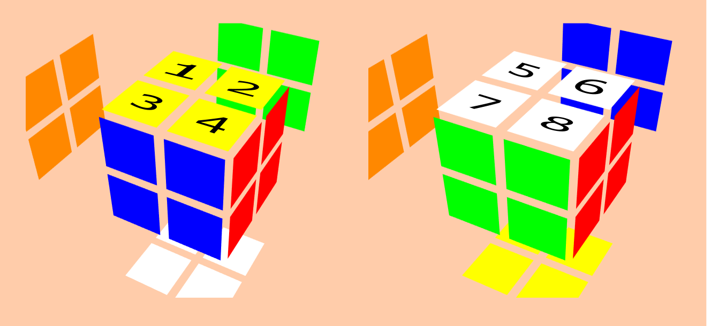

# 2x2x2 Rubik's Cube modelled in Julia

I tried to make the simplest and most elegant model of a 2x2x2 Rubik's Cube puzzle I could, with every face turn and axis rotation defined (even though 3 faces suffice).

## Defining the cube

This puzzle consists of 8 total pieces (all corner pieces with 3 sides each).  
We can represent every possible state using two arrays:  
- A **position array**, defining where each piece is located
- An **orientation array**, defining "how a certain corner is rotated"

The first one is simply an 8-uple that will get its elements moved around accordingly:
```julia
cp = (1, 2, 3, 4, 5, 6, 7, 8)
```
The numbers follow the Speffz scheme, which looks like this in case you're not familiar with it:



The second one is also (of course) an 8-uple that can only hold `0, 1, 2`:
```julia
co = (0, 0, 0, 0, 0, 0, 0, 0)
```

A corner has orientation `0` if its Up/Down solved colour is facing Up or Down, orientation `1` if it is rotated clockwise once, and orientation `2` if it is rotated counter-clockwise once (or clockwise twice, it's obviously the same).

These two 8-uples are then grouped together in a single tuple, for easier manipulation:

```julia
cube = (cp, co)
```

## Defining the moves

In brief, the Rubik's cube notation is as follows:

| Letter |   Description   |
|:------:|:---------------:|
|    R   |    right face   |
|    U   |     up face     |
|    F   |    front face   |
|    L   |    left face    |
|    D   |    down face    |
|    B   |    back face    |
|    x   | whole cube as R |
|    y   | whole cube as U |
|    z   | whole cube as F |

The letter on its own means 90 degrees clockwise; adding a prime `'` means 90 degrees counter-clockwise, adding a `2` means 180 degrees.

Each move applies certain permutation to both tuples, then adds the corresponding change in orientation to the second tuple.

For example, the move `R` (a 90 degree clockwise turn of the right face) changes the pieces as follows:

- Piece in 3 goes to 2, then gets rotated clockwise (+1)
- Piece in 6 goes to 3, then gets rotated counter-clockwise (+2)
- Piece in 7 goes to 6, then gets rotated clockwise (+1)
- Piece in 2 goes to 7, then gets rotated counter-clockwise (+2)

The way this gets represented is with two functions: one that applies the permutation change, and one that applies the orientation change:

```julia
Rp((a,b,c,d,e,f,g,h)) = (a,c,f,d,e,g,b,h)
Ro(a) = @. (a + (0,1,2,0,0,1,2,0)) % 3
```

Using the wonders of Julia such as destructuration and the `@.` macro that vectorizes functions, this is effortless.

What's only left is defining the function `R` that applies the permutation `Rp` to both tuples, then the orientation `Ro` to the second one:

```julia
R((p,o)) = Rp(p), (Ro∘Rp)(o)
```

Don't tell me that doesn't look _exceedingly_ cool!  
Function composition is super easy in Julia, just using the `\circ` symbol (this thing: `∘`), same as you would do if you wrote a mathematical function!

Now, we should do the same for the remaining 17 face turns..... If we were drunk or silly, that is. 🍻

A better approach is knowing that by the use of just two moves and a rotation we can define every other move and rotation! <sub>Actually, this is achievable by just 2 permutations since the cube group is 2-gen, but let's stick to single moves.</sub>

In this case, I defined the move `U` and the rotation `x` as my "atoms", just as I showed you with the move `R`.  

After that, defining other moves is just beautiful:

```julia
D = x ∘ x ∘ U ∘ x ∘ x # since D = x2 U x2
F = x ∘ x ∘ x ∘ U ∘ x # since F = x U x'
# ... etc
```

Note that `F` seems to be defined as `x x x U x` instead of `x U x x x`, but that's just because the order of execution is the inverse. It works just like any composition:

```julia
h(x) = (f ∘ g)(x) # h(x) = f(g(x)), g gets applied before f
```

What a charm! Every single move and rotation has been defined without a single 'sigh'.

## String to function

Naturally, you wouldn't be writing move sequences as `(R ∘ U ∘ B ∘ B ∘ B ∘ F)(cube)`, but rather, you'd want to give some function a string like `"F B' U R"` and get all that applied for you.

My solution for this was defining a function that received a "single move string" as input (such as `"R"`, `"F2"`, `"B'"`) and output a function that represents that permutation, so that you could use it like this:

```julia
single_move_string_to_func("F2")(cube)
# the same as F(F(cube))
```

The name I used was actually `m_to_mf` instead of all that word soup in my example.

That function would simply check if the length of the given string is 2, then if the 2nd element is a `2` it would return the function twice, otherwise thrice, or if the length is `1`, just once. <sub>Which function? The function corresponding to that face turn, retrieved using `getfield`. Defining a dictionary that holds the corresponding function for each move was equally efficient when benchmarked using BenchmarkTools.</sub>

```julia
function m_to_mf(m)
    func = getfield(Main,Symbol(m[1]))
    length(m)==2 ? (m[2]=='2' ? func∘func : func∘func∘func) : func
end
```

The "double ternary operator" looks a bit strange, but I decided this usage of it was simple enough to understand, so I left it like that. Oh also, remember that in Julia indexing begins in `1` rather than in `0`.

Note that this doesn't actually check if a move is a prime (like `R'`), but just assumes that if the move is of length 2 and the second character isn't a `2`, then it has to be a `'`.

>"If you write stuff the wrong way, it isn't my problem to handle it 😛"
> -My program

Then, converting a string of such "single move string" separated by spaces (a.k.a. the good ol' regular scramble string) to a single function is a piece of 🍰: you just split the string, map `m_to_mf`, then fold that array (the inverse, rather) of functions using composition:

```julia
str_to_func(string) = foldl(∘, map(m_to_mf, reverse(split(string))))
```

## The extreme efficiency of Julia

The code is wonderful, but how does it perform? Well let's try it!

I defined a scramble and a solution (it's actually a 3x3x3 FMC solve, but it will work anyway):

```julia
scramble = "R' U' F D2 B2 U2 L2 B2 U2 F2 R' B2 R' U' F' R D2 L D L' U2 F R' U' F"
solution = "U F2 B U B D R2 L2 F2 U' F2 L2 D F2 D' R2 D' B D L B'"
```

Now, you could define the function that represents the state after you apply `scramble` and `solution` like this:

```julia
pos = str_to_func(scramble*" "*solution)
# use it as pos(cube) !
```

But instead, to benchmark using BenchmarkTools, I'll do this:

```julia
@btime _pos(cube) setup=(_pos=str_to_func(scramble*" "*solution))
```

Holy sh*^%$#$%!!! Look at the result:

```
19.999 μs (1 allocation: 144 bytes)
((1, 2, 3, 4, 5, 6, 7, 8), (0, 0, 0, 0, 0, 0, 0, 0))
```

**????????????** That is just ridiculous.  
In case you don't know, 1 μs is 1 second divided into **a million**.

## Are you still baffled?

You should be.

## Thank

_Julia_ for existing, _alg.cubing.net_ for the images, _dillinger.io_ for being a cool Markdown editor, _you_ for the read!

Also, huge thanks to Tao Yu for the Biang Biang noodles he provided.

This complete piece of README couldn't have been possible without Antonio Kam's issue.
